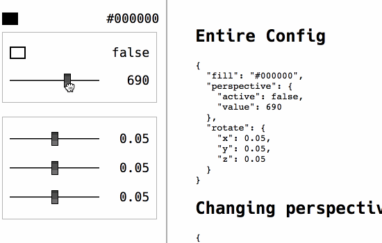

# CONFIGUI

Create JS property controls from HTML form controls.




### The HTML
Use any valid HTML input types (including `color`)

```
<div data-configui>
	<input type="range" min="0" max="10" step="10" name="speed" />
	<div data-group="rotation">
		<input name="x" min="3.15" max="3.15" step="0.01" />
		<input name="y" min="3.15" max="3.15" step="0.01" />
	</div>
</div>
```

### The Markup
Listen to properties, or defined groups of properties.

```
  ConfigGUI.on('rotation.x', function(value, htmlEvent) {
    console.log(e);
  })

  ConfigGUI.on('fill', function(value, htmlEvent) {
    console.log(color);
  })
```
